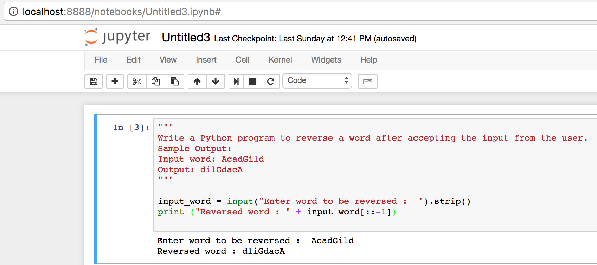
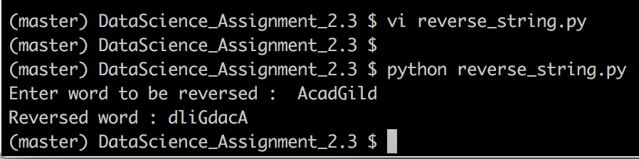

# Problem Statement :
```
Write a Python program to reverse a word after accepting the input from the user.
Sample Output:
Input word: AcadGild
Output: dilGdacA
```

## Snapshot - Run from jupyter REPL 
```
import reverse_string.ipynb in jupyter REPL 
```




## Snapshot - Run from command line bash
```
Command to execute : python reverse_string.py
```


